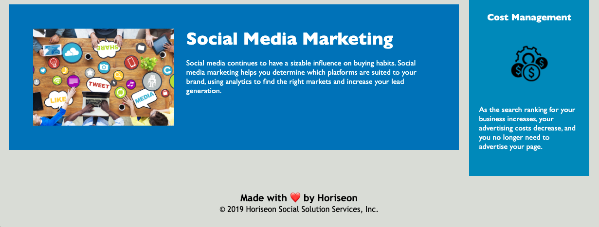

# Horiseon Website

## Description
This is a website built for Horiseon, a digital marketing company. The website code has been updated to follow accessibility standards so that the website is optimized for search engines.

The original HTML contatined too many <samp>div</samp> tags, which would have made it hard for screen readers to understand. These tags were changed to semantic HTML tags, inlcuding header, nav, section, article and footer. The CSS code was changed to match these tags where necessary so that the website still functioned as the creator intended.

The original CSS document showed that there were several classes with the same styles. This repeating code was consolidated into a single CSS rule where possible. For example, all of the images in the <samp>aside</samp> were the same size, so those styles were consolidated using the class for that section and the <samp>img</samp> selector. This consolidation occurred several times.

The semantic HTML tags and consolidated CSS rules cleaned up the code for this project. This made it easier as a developer to read and understand the function of the code.

## Installation
In order to access this repository, the user needs to clone it from GitHub using the command <samp>git clone git@github.com:kaylab78/horiseon-website.git</samp> in their command line interface.

## Usage
The links in the navigation at the top of the page can be clicked in order to jump to the corresponding section on the page. 

For example, if "Social Media Marketing" in the navigation bar is clicked (as shown here), 
    
    
the page will jump to the Social Media Marketing section (as shown here).
    

To view the deployed website, visit [https://kaylab78.github.io/horiseon-website/](https://kaylab78.github.io/horiseon-website/).

## Credits
The original code for the project was cloned from Xander Rapstine at [https://github.com/coding-boot-camp/urban-octo-telegram](https://github.com/coding-boot-camp/urban-octo-telegram).

The wording for the license on this project is from the MIT License outlined at [https://choosealicense.com/licenses/mit/](https://choosealicense.com/licenses/mit/).

## License
Copyright (c) 2022 Kayla Backus

Permission is hereby granted, free of charge, to any person obtaining a copy of this software and associated documentation files (the "Software"), to deal in the Software without restriction, including without limitation the rights to use, copy, modify, merge, publish, distribute, sublicense, and/or sell copies of the Software, and to permit persons to whom the Software is furnished to do so, subject to the following conditions:

The above copyright notice and this permission notice shall be included in all copies or substantial portions of the Software.

THE SOFTWARE IS PROVIDED "AS IS", WITHOUT WARRANTY OF ANY KIND, EXPRESS OR IMPLIED, INCLUDING BUT NOT LIMITED TO THE WARRANTIES OF MERCHANTABILITY, FITNESS FOR A PARTICULAR PURPOSE AND NONINFRINGEMENT. IN NO EVENT SHALL THE AUTHORS OR COPYRIGHT HOLDERS BE LIABLE FOR ANY CLAIM, DAMAGES OR OTHER LIABILITY, WHETHER IN AN ACTION OF CONTRACT, TORT OR OTHERWISE, ARISING FROM, OUT OF OR IN CONNECTION WITH THE SOFTWARE OR THE USE OR OTHER DEALINGS IN THE SOFTWARE.